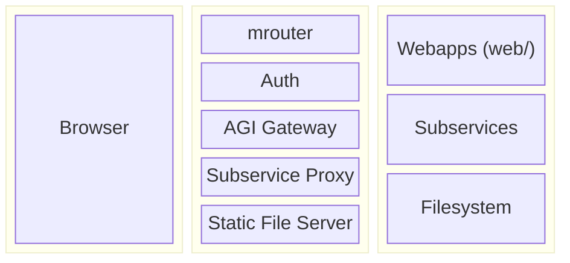
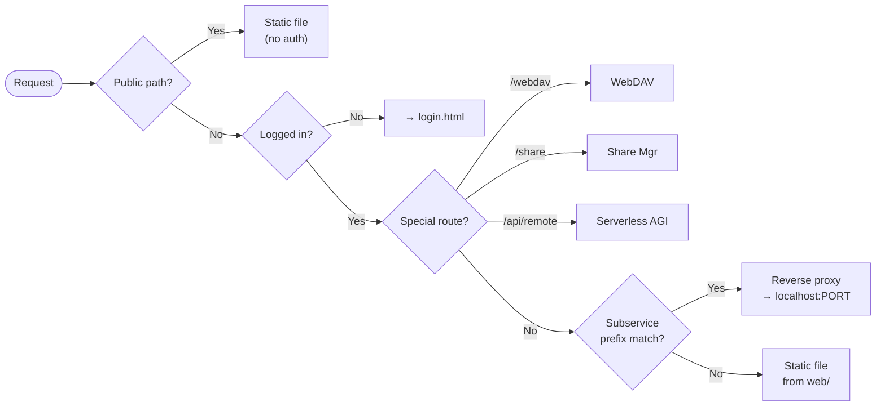
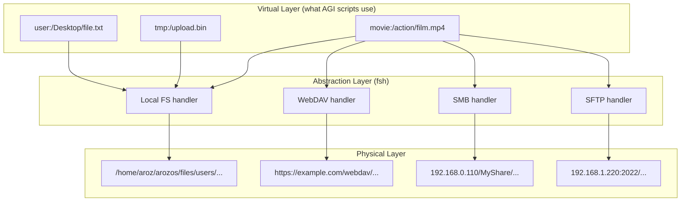
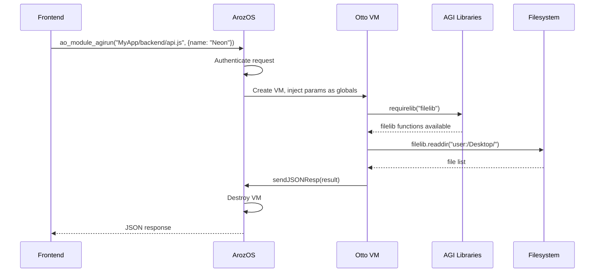
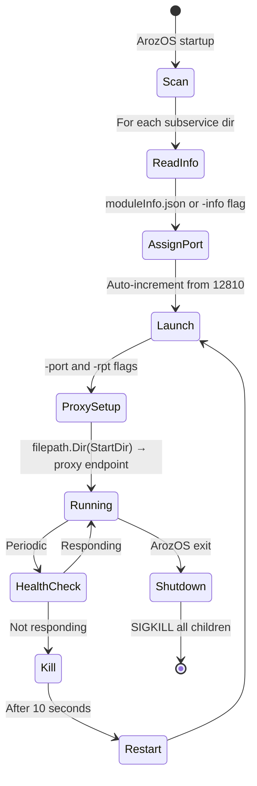

# Architecture

This document covers ArozOS internals: how requests are routed, how the filesystem works, and how the AGI scripting engine fits together. This is reference material for understanding the system's behavior, not a how-to guide.

## Component Overview



*Columns: **Client** | **ArozOS Core** | **Backends***

Requests arrive from the browser, pass through ArozOS's router and auth layer, then are dispatched to one of three backend types: static webapps, reverse-proxied subservices, or the filesystem (via AGI). The sections below detail each path.

## Request Routing



All HTTP requests flow through `mrouter` (in `main.router.go`). The priority order determines what handles each request:

1. **Public static paths** — `/favicon.ico`, `/manifest.webmanifest`, `/robots.txt`, `/img/public/*`, `/script/*`. No authentication required.

2. **Login and reset pages** — `/login.html` (with template rendering for the auth icon and redirect URL), `/reset.html` (only when users exist).

3. **First-run setup** — `/user.html` is only accessible when the user count is zero.

4. **Special routers** (authenticated):
   - `/webdav/*` → WebDAV manager
   - `/share/*` → Share manager
   - `/api/remote/*` → Serverless AGI endpoints
   - `/fileview/*` → Directory listing server

5. **Root path** (`/`) — redirects based on the user's interface module settings. Usually goes to `desktop.html`.

6. **Homepage** (`/www/*`) — user personal homepages, if enabled.

7. **Authenticated static/subservice paths** — this is where most requests end up:
   - **First:** check if the path matches a subservice reverse proxy endpoint. If yes, proxy the request.
   - **Then:** serve the static file from `web/`.

8. **Unauthenticated fallback** — files in `public/` subdirectories are accessible without login. Everything else redirects to the login page.

### Subservice Proxy Priority

The subservice check happens before static file serving. This means a subservice with endpoint `Terminal` intercepts `/Terminal/anything` even if `web/Terminal/anything` exists as a file. This is by design — the subservice owns its URL namespace.

The matching is a prefix check:
```go
requestURL[1:len(thisServiceProxyEP)+1] == thisServiceProxyEP
```

Combined with the length check `len(requestURL) > len(thisServiceProxyEP)+1`, this matches any path that starts with the endpoint string followed by at least one more character.

### WebSocket Proxying

When a proxied request contains `Upgrade: websocket`, ArozOS switches from HTTP reverse proxy to WebSocket proxy. The `A-Upgrade: websocket` header is set, and a `websocketproxy` handler takes over. This is how ttyd's xterm.js WebSocket works through ArozOS.

### Auth Headers on Proxied Requests

ArozOS injects `aouser` (username) and `aotoken` (session token) headers into all proxied requests. Subservices can use these to identify the user and call back to the AGI gateway.

---

## Filesystem Virtualization



ArozOS has three filesystem layers:

| Layer | Path format | Example |
|-------|------------|---------|
| Virtual | `{vroot_id}:/{subpath}` | `user:/Desktop/myfile.txt` |
| Abstraction (fsh) | Handler + subpath | `fsh(localfs) + /files/users/alan/Desktop/myfile.txt` |
| Physical | Absolute path | `/home/aroz/arozos/files/users/alan/Desktop/myfile.txt` |

The virtualization layer (`user:/`, `tmp:/`, and custom storage pool IDs) is what AGI scripts and webapps interact with. The abstraction layer handles different backend storage types (local, WebDAV, SMB, SFTP, FTP) through a uniform interface. The physical layer is the actual disk.

### Virtual Roots

- `user:/` — the current user's home directory
- `tmp:/` — temporary storage (cleaned based on `-tmp_time`)
- Custom IDs from storage pools (e.g. `movie:/`, `backup:/`)

---

## AGI Execution Model



AGI (ArozOS Gateway Interface) is a server-side JavaScript engine powered by [Otto](https://github.com/robertkrimen/otto). It executes scripts in a sandboxed VM with access to ArozOS APIs.

### Execution Scopes

| Scope | Trigger | Available APIs |
|-------|---------|---------------|
| Startup (`init.agi`) | ArozOS boot | System functions, registration, appdata |
| WebApp backend | Frontend `ao_module_agirun()` call | System + user functions |
| Serverless | External HTTP to `/api/remote/` | System + user + serverless functions (GET/POST params, request body) |
| Scheduler | Timed interval | System + user functions (runs as script owner) |
| Personal homepage | HTTP to `/www/{user}/` | System + user functions |

### Request Flow

1. Frontend calls `ao_module_agirun("MyApp/backend/script.js", {params})`
2. This POSTs to `/system/ajgi/interface?script=MyApp/backend/script.js`
3. ArozOS authenticates the request, creates an Otto VM
4. Parameters are injected as global variables in the VM
5. The script runs, calling `sendResp()` or `sendJSONResp()` to return data
6. The VM is destroyed after execution

### Libraries

Scripts load libraries with `requirelib("name")`. Each library adds functions to the VM's global scope under a namespace (e.g. `filelib.readFile()`). Libraries are only available after a successful `requirelib()` call.

See [AGI Reference](agi-reference.md) for the complete API.

### Detached Execution

`execd("script.js", "payload")` launches a script in a background goroutine. The parent script can return immediately while the child continues processing. The child receives the payload via the `PARENT_PAYLOAD` variable and can check `PARENT_DETACHED` to know it's running detached.

---

## Subservice Lifecycle



1. **Startup scan:** ArozOS globs `./subservice/*/` and processes each directory.
2. **Module info:** reads `moduleInfo.json` or calls the binary with `-info`.
3. **Port assignment:** auto-increments from the base port (default 12810).
4. **Launch:** executes the binary or `start.sh` with `-port` and `-rpt` flags.
5. **Proxy setup:** creates a reverse proxy from `filepath.Dir(StartDir)` to `localhost:port`.
6. **Health monitoring:** if the subservice stops responding, ArozOS kills and restarts it after 10 seconds.
7. **Shutdown:** on ArozOS exit, all subservice processes are killed (SIGKILL on Linux, TASKKILL on Windows).

### Module Registration

Subservice modules are appended to the same `LoadedModule` list as webapp modules. The desktop and mobile UIs make no distinction — both types appear in the app launcher if `SupportFW` is true.

---

## Desktop vs Mobile UI

ArozOS checks `navigator.userAgent` against a mobile pattern on page load:

```javascript
/Android|webOS|iPhone|iPad|iPod|BlackBerry|IEMobile|Opera Mini/i
```

If matched, `desktop.html` redirects to `mobile.html`. The mobile UI has a 30px sidebar with a toggle arrow that extends 20px into the main frame area. Float windows are full-width on mobile.

Both UIs use the same module list API and the same float window iframe mechanism — the difference is layout and navigation, not functionality.
